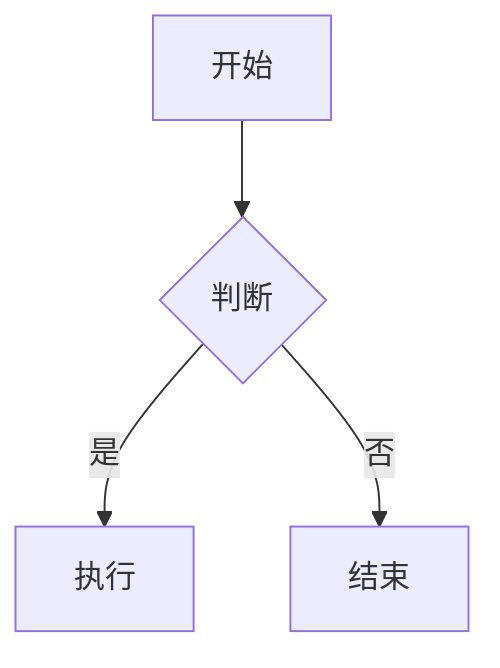

# 📝 Markdown 快速上手（3分钟学会）

## 🚀 第一步：创建 Markdown 文件

```bash
nvim test.md
```

---

## ⚡ 第二步：写点内容

按 `i` 进入插入模式，复制粘贴这些内容：

```markdown
# 我的第一篇 Markdown 文档

这是一段**重要的内容**，还有*斜体文字*。

## 功能列表

- 实时预览
- 自动格式化
- 表格编辑

## 代码示例

这是一段 Python 代码：

```python
def hello():
    print("Hello, World!")
```

## 任务清单

- [ ] 学习 Markdown
- [ ] 写文档
- [x] 完成第一个文件

## 表格

| 姓名 | 年龄 | 城市 |
|------|------|------|
| 张三 | 25 | 北京 |
| 李四 | 30 | 上海 |
```

按 `Esc` 退出插入模式

---

## 🎯 第三步：打开预览

按快捷键：
```
<Space>mp
```

也就是：
1. 按空格键（Space）
2. 然后按 m
3. 然后按 p

**浏览器会自动打开，显示渲染后的效果！** ✨

---

## 🎨 第四步：试试实时同步

保持预览窗口打开，在 nvim 中：

1. 按 `i` 进入插入模式
2. 修改任何内容（比如改个标题）
3. 按 `Esc`，然后 `:w` 保存
4. **看浏览器，内容自动更新了！** 🎉

---

## ⭐ 常用操作（记住这 5 个就够了）

### 1️⃣ 预览控制

| 快捷键 | 功能 |
|--------|------|
| `<Space>mp` | 打开预览 |
| `<Space>ms` | 关闭预览 |
| `<Space>mt` | 切换预览（开/关） |

### 2️⃣ 快速加粗/斜体

**加粗当前单词**：
```
1. 光标移到单词上（比如 "重要"）
2. 按 <Space>mb
3. 结果：**重要**
```

**斜体当前单词**：
```
1. 光标移到单词上
2. 按 <Space>mi
3. 结果：*单词*
```

### 3️⃣ 创建表格（超简单！）

```
1. 按 <Space>tm  启用表格模式
2. 输入：| 姓名 | 年龄 |
3. 按 Enter，输入 ||（两个竖线）
4. 自动生成表格分隔符！
5. 继续输入数据，表格会自动对齐
```

### 4️⃣ 标题导航

| 快捷键 | 功能 |
|--------|------|
| `]]` | 跳到下一个标题 |
| `[[` | 跳到上一个标题 |
| `<Space>mo` | 显示文档目录 |

### 5️⃣ 插入常用元素

| 快捷键 | 功能 | 结果 |
|--------|------|------|
| `<Space>mh` | 插入 H1 标题 | `# ` |
| `<Space>mH` | 插入 H2 标题 | `## ` |
| `<Space>m-` | 插入列表项 | `- ` |
| `<Space>m[` | 插入复选框 | `- [ ] ` |

---

## 🎯 实战：写一个 README

试试写一个项目的 README：

```bash
nvim README.md
```

输入以下内容：

```markdown
# 我的项目

一个**超级棒**的项目！

## 安装

```bash
npm install my-project
```

## 功能

- [x] 用户登录
- [x] 数据展示
- [ ] 导出报表

## 使用方法

```javascript
const app = require('my-project');
app.start();
```

## 贡献者

| 姓名 | GitHub |
|------|--------|
| 张三 | @zhangsan |
| 李四 | @lisi |
```

按 `<Space>mp` 预览，看看效果！

---

## 🎨 高级技巧

### 1. 流程图（Mermaid）

在 Markdown 中输入：

```markdown

```

预览会自动渲染成漂亮的流程图！

### 2. 数学公式

```markdown
行内公式：$E = mc^2$

块级公式：
$$
\frac{-b \pm \sqrt{b^2 - 4ac}}{2a}
$$
```

预览会自动渲染数学公式！

### 3. 代码高亮

支持几乎所有编程语言：

````markdown
```python
def fibonacci(n):
    if n <= 1:
        return n
    return fibonacci(n-1) + fibonacci(n-2)
```

```javascript
function hello() {
    console.log("Hello!");
}
```

```rust
fn main() {
    println!("Hello, Rust!");
}
```
````

---

## 💡 技巧总结

### 写文档时的工作流

```
1. nvim document.md          # 打开文件
2. 按 <Space>mp              # 打开预览
3. 按 i                      # 进入插入模式
4. 写内容...
5. 按 Esc                    # 退出插入模式
6. :w                        # 保存（预览自动更新）
7. 继续编辑...
```

### 快速插入列表

```
输入：- 第一项
按 Enter
自动：- （光标在这里）← 自动续写！
继续输入就行
```

### 快速创建链接

```
方法 1：
1. 光标在 "GitHub" 上
2. 按 <Space>ml
3. 结果：[GitHub]()
4. 在括号里输入 URL

方法 2：
1. v 选中文本
2. 按 <Space>ml
3. 添加 URL
```

---

## ❓ 常见问题

### Q: 预览没有打开？

**A:** 检查：
```vim
:messages  " 查看错误信息
:Lazy log markdown-preview.nvim  " 查看插件日志
```

### Q: 内容不自动更新？

**A:**
1. 确保保存了文件（`:w`）
2. 或者重启预览：`<Space>ms` 然后 `<Space>mp`

### Q: 表格没有自动对齐？

**A:**
1. 启用表格模式：`<Space>tm`
2. 或手动对齐：`<Space>tr`

### Q: 快捷键不生效？

**A:**
1. 确保在普通模式（按 `Esc`）
2. 确保在 Markdown 文件中（`:set filetype?` 应该显示 `markdown`）

---

## 🎉 现在开始写作吧！

试试这些场景：

### 场景 1：写笔记
```bash
nvim notes.md
按 <Space>mp
开始记笔记！
```

### 场景 2：写博客
```bash
nvim blog.md
按 <Space>mp
开始写博客！
```

### 场景 3：写文档
```bash
nvim docs.md
按 <Space>mp
开始写文档！
```

---

## 📚 进阶学习

想了解更多功能？查看：

- 📖 **完整教程**：`MARKDOWN-GUIDE.md`（562行详细教程）
- ⚡ **快捷键表**：`CHEATSHEET.md`

```bash
# 在 nvim 中打开并预览
nvim MARKDOWN-GUIDE.md
按 <Space>mp
```

---

## 🎯 练习题

试试完成这些任务：

- [ ] 创建一个包含 3 个标题的文档
- [ ] 添加一个任务清单（5个项目）
- [ ] 创建一个 3x3 的表格
- [ ] 插入一段代码块（任意语言）
- [ ] 使用 `]]` 在标题间跳转
- [ ] 把一个单词加粗
- [ ] 创建一个链接

---

**恭喜！你已经学会使用 Markdown 编辑器了！** 🎉

开始享受丝滑的写作体验吧！✨
